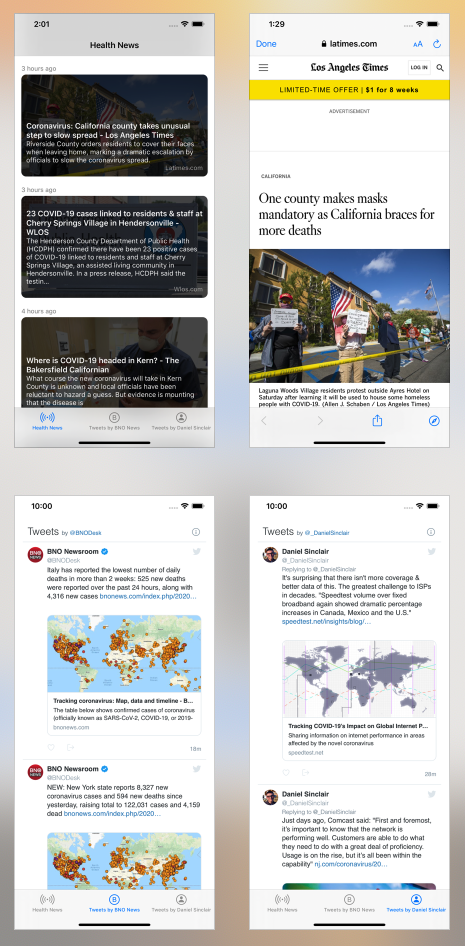

## covid19.swift

Quick iOS app to show some COVID-19 / health news and tweets :zap:

## Requirements

iOS 13 for [SF Symbols](https://developer.apple.com/design/human-interface-guidelines/sf-symbols/overview/).

## Credits

- [News API](https://newsapi.org)
- [BNO Newsroom](https://twitter.com/BNODesk)
- [Daniel Sinclair](https://twitter.com/_DanielSinclair)

## Contact

- [github.com/dkhamsing](https://github.com/dkhamsing)
- [twitter.com/dkhamsing](https://twitter.com/dkhamsing)

## License

This project is available under the MIT license. See the [LICENSE](LICENSE) file for more info.
